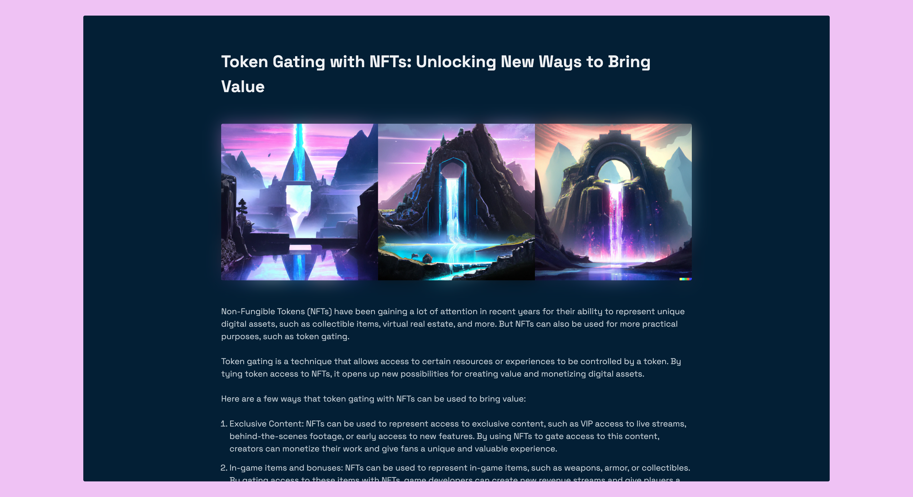

# Simple HTML Blog

This is an example of a simple blog page that can be submarined on Pinata IPFS.

## Tech:

- Barebones HTML.
- [PicoCSS](https://picocss.com/) to add styling.

## License

[MIT](https://choosealicense.com/licenses/mit/)

 

### Content:

The contents used in the blog post example were generated by AI:

- Copywriting: [ChatGPT](https://chat.openai.com/chat).
- Illustrations: [Dall-E](https://openai.com/dall-e-2/).
